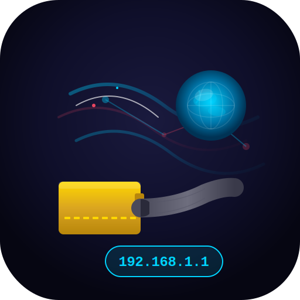

<p align="center">
  
</p>

<h1 align="center">IP View Pro</h1>

<p align="center">
  <strong>Professional IP Monitoring & Network Analysis Tool</strong>
</p>

<p align="center">
  
  
  
  
  <br>
  
  
  
</p>

<p align="center">
  A professional, high-performance Qt 6 application for monitoring and analyzing public IP addresses, geolocation data, and network performance on <strong>Arch Linux</strong>.
</p>

<p align="center">
  Built with <strong>C++26</strong> (ISO/IEC 14882:2026) and <strong>Qt 6.11</strong> (March 2026) — <code>consteval</code>, <code>std::to_array</code>, structured bindings, <code>[[nodiscard]]</code>, and <code>noexcept</code> throughout.
</p>

<p align="center">
  All source code comments are in professional US English. No <code>TODO</code> or <code>FIXME</code> stubs remain.
</p>

---

## Screenshot

<p align="center">
  
  <br>
  <em>IPView Pro main interface — Overview tab showing IP geolocation with multi-API failover.</em>
</p>

> **Note:** A screenshot (`media/screenshot.png`) should be placed in the `media/` directory.  
> Recommended dimensions: 800×600 px or larger. Capture the main window with the Overview tab active and some data loaded.

---

## Features

Tab icons are rendered from SVG files located in the [`svgs/`](svgs/) directory (512×512 px native, displayed at 14×14 px inline).

> **Compact Tab Bar:** All 10 tabs (Overview, Whois, Port Scanner, Network Tools, Speedtest, TLS Auditor, Topology, Telemetry, History, About) are always visible without scrolling — thanks to reduced padding (`6px 12px`), smaller font (`11px`), and `setUsesScrollButtons(false)` + `setExpanding(true)` on the QTabBar. (`TelemetryPersistenceModule`, `ServerSelectionModule`, `AlertEngine`, and `PacketModule` are background services without dedicated tabs.)

###  Multi-API Geolocation
- **12+ APIs** with automatic failover, sparse data enrichment, and IPv6 support.
- Normalizes all responses into a unified **18-field format** (IP, city, region, country, continent, ISP, ASN, coordinates, timezone, currency, security, and more).
- Smart fallback: if the primary API returns incomplete data, the next API is queried automatically.

###  Advanced Speedtest
- Professional `speedtest-cli` (Python sivel) integration with `--json` structured output.
- Real-time metrics: **Ping**, **Download**, **Upload** with animated progress bar.
- **Server Browser:** Sortable table with ID, sponsor, location, and distance. Double-click to select.
- Visual test phases: selecting server → ping → download → upload → finalizing.
- Options: single connection, secure mode (HTTPS), share results.

###  Integrated Whois / RDAP
- Tabular Whois/RDAP lookups across 3 providers: RDAP (Standard), IP-API (Detailed), IP-Whois.io.
- API-specific data normalization with consistent output format.
- Automatic IP address carry-over from the Overview tab.

###  Network Tools
- **Ping:** 4 ICMP packets with real-time output, **Cancel button**, 60-second auto-timeout.
- **iPerf3:** Client/server mode with real-time speed visualization and color-coded progress bar (green ≥ 100 Mbps, cyan ≥ 50, orange ≥ 10, red < 10).
- **Traceroute:** Cross-platform support (Linux: `traceroute`/`tracepath`, Windows: `tracert`) with Cancel button.

###  IP Change History
- Automatic recording of all IP changes during the session (up to 50 entries).
- Accurate per-entry timestamps.
- **Clear button** to reset history.

###  Security Hardening
- **Command Injection Prevention:** All user input is validated via `isValidNetworkTarget()` before being passed to `QProcess`. Shell metacharacters (`; | & \` $ () {} <> # !`) are blocked. Only IPv4, IPv6, and RFC-1123 hostnames are accepted.
- **SSL/TLS Enforcement:** `enforceStrictSsl()` is called on every `QNetworkReply` in all three network managers — SSL handshake failures abort the request (MITM prevention).
- **Absolute Tool Paths:** `findSystemTool()` resolves full binary paths via `QStandardPaths` with fallback to `/usr/bin/`, `/bin/`, `/usr/sbin/` — no PATH hijacking possible.
- **Compiler Hardening:** `-Werror`, `-fstack-protector-strong`, `-D_FORTIFY_SOURCE=3`, `-Wl,-z,relro -Wl,-z,now`.
- **AddressSanitizer:** Optional via `cmake -DSANITIZE=ON`.

###  Database Persistence (SQLite)
- **Automatic History Logging:** Every IP lookup is persisted to a local SQLite database
  (`~/.config/IPView/ipview_history.db`) with WAL journal mode for concurrent access.
- **Tables:** `ip_history` (IP, country, city, org, ASN, full JSON payload, timestamp) and
  `telemetry` (interface stats with RX/TX speeds).
- **Thread-Safe:** All database operations are serialized via `QMutex`. Uses parameterized
  queries — no SQL injection possible.
- **Maintenance:** `vacuum()`, `clearHistory()`, and configurable query limits.

###  Telemetry Persistence (Historical Aggregation)
- **Periodic Aggregation:** Background timer-driven engine (`TelemetryPersistenceModule`)
  records interface statistics into the `telemetry_aggregated` SQLite table at configurable
  intervals (default 60 seconds).
- **Aggregated Stats:** Each record stores min/avg/max RX/TX speeds, total bytes transferred,
  and the time window of the sample.
- **Historical Queries:** Retrieve aggregation history per interface, get a summary for any
  time range (`getStatsForWindow`), or fetch the latest snapshot.
- **Auto-Start:** Persistence engine auto-starts at launch if previously enabled (setting
  saved in `~/.config/IPView/IPView.conf`).
- **Maintenance:** Clear all aggregated history with `clearAggregatedHistory()`.

###  Speedtest Server Selection Module
- **`ServerSelectionModule`** — Modular server browser extracted from SpeedtestTab.
  `getAvailableServers()` fetches and parses the speedtest.net server list.
- **Filtering:** `filterByDistance()` and `filterByQuery()` for smart server discovery.
- **Sorting:** `sortServers()` by ID, sponsor, location, or distance (ascending/descending).
- **Lookup:** `findClosestServer()` and `findServerById()` for quick server selection.
- Uses `std::expected` for type-safe error propagation with structured error messages.

###  Real-Time Network Telemetry
- **`/proc/net/dev` Monitoring:** Background timer-driven polling (default 2s interval).
- **Per-Interface Stats:** RX/TX bytes, packets, errors, and real-time transfer speeds (bytes/s).
- **Smart Interface Filtering:** Automatically excludes loopback (`lo`), Docker (`docker0`),
  virtual (`veth*`, `br-*`, `tun*`, `tap*`), and VM interfaces (`vbox*`, `vmnet*`).
- **C++26 `std::expected`:** Type-safe error propagation with `std::from_chars` for
  performant string-to-integer conversion.

###  Asynchronous Port Scanner
- **Non-Blocking:** Uses `QTcpSocket` with configurable timeout (500ms default).
- **Batch Processing:** Up to 100 parallel connections per batch, with 10ms delay between
  batches to avoid network flooding.
- **Service Detection:** Resolves 28+ well-known ports to service names (SSH, HTTP, MySQL, etc.).
- **Progress Reporting:** Real-time `scanProgress(current, total)` and `portFound()` signals.
- **Safe Cancellation:** `cancelScan()` aborts all active connections immediately.

###  Copy All / Export JSON
- **Copy All:** One-click clipboard copy of all IP and geolocation data as formatted text.
- **Export JSON:** Save IP data as a formatted JSON file via the system file dialog.

###  System Tray

- Close to tray; double-click to restore.
- Context menu: Restore Window / Exit.
- Informative tray tooltip with IP, country flag (Unicode), ISP, ASN, and timestamp.

###  Topology Tab
- **QGraphicsView network path visualization:** Runs `traceroute` to a target host and renders each hop as a color-coded node on an interactive canvas.
- **Color-coded by latency:** Green (<10 ms), blue (<50 ms), orange (<150 ms), red (≥150 ms or timeout). Destination node highlighted in green and enlarged.
- **Interactive controls:** Scroll-wheel zoom, click-drag pan, tooltips with hop IP, hostname, and exact latency.
- **Security-hardened:** Input validated via `isValidNetworkTarget()`, binary resolved via `findSystemTool("traceroute")`.

###  Active Connections Monitor (PacketModule)
- **Background service:** Parses `/proc/net/tcp`, `/proc/net/tcp6`, `/proc/net/udp`, and `/proc/net/udp6` at configurable intervals (default 5s).
- **Hex-to-IP conversion:** Converts kernel hex-encoded addresses (little-endian byte order) to standard dotted-decimal IPv4 / colon-hex IPv6.
- **TCP state decoding:** Established, Listen, TimeWait, CloseWait, and more.
- **No root required:** World-readable procfs entries.

###  About Tab
- Build information: compiler (auto-detected GCC/Clang/MSVC), system, Qt version, C++ standard, compile date.
- Public Domain — no license, no restrictions.

---

## C++26 & Qt 6.11 Technology Stack

| Feature | Location | Benefit |
|---------|----------|---------|
| `SecurityUtil.h` | All source files | Input validation, SSL enforcement, absolute tool paths |
| `saturate_fix.h` (polyfill) | Force-included via CMake | Polyfill for missing `std::saturate_cast` (GCC 16.1 / libstdc++) |
| `std::to_array<std::string_view>` | NetworkManager, DataNormalizer | Compile-time API endpoint lists — no runtime initialization |
| `consteval` | main.cpp | Application metadata (name, version) guaranteed at compile time |
| `[[nodiscard]]` | 45× across the project | Compiler warns on discarded return values |
| `noexcept` | 55× across the project | Exceptions stopped at API boundaries |
| Structured bindings | 8 files | `auto const& [key, value]` — more readable, type-safe |
| `std::expected` | TelemetryModule, ServerSelectionModule | Type-safe error propagation without exceptions |
| `std::from_chars` | TelemetryModule, ScannerModule | Performant string-to-integer conversion |
| `std::optional` | DatabaseModule | Nullable return values for database queries |
| `std::unique_ptr` | ScannerModule | RAII socket pool management |
| `QLatin1StringView` | main.cpp | C++26-compatible string view for Qt APIs |
| `static_assert` | MainWindow.cpp, DashboardView.cpp | Compile-time field list size consistency |
| `std::move` | SpeedtestTab, DatabaseModule | Efficient data transfer |

---

## Requirements

### Qt 6 Dependencies (Arch Linux)

The application requires the following packages to build and run:

```bash
sudo pacman -S qt6-base qt6-svg cmake base-devel
```

| Package | Provides |
|---------|----------|
| `qt6-base` | Qt6Core, Qt6Widgets, Qt6Network, Qt6Sql (with SQLite plugin) |
| `qt6-svg`  | Qt6Svg — SVG icon rendering |
| `cmake`    | Build system generator |
| `base-devel` | GCC/Clang, make, and other build essentials |

### C++26 Compiler
```bash
# GCC 14+ or Clang 18+
sudo pacman -S gcc       # Tested with GCC 16.1.1
# or
sudo pacman -S clang     # Clang 18+
```

**Note on GCC 16.1:** A C++26 polyfill for `std::saturate_cast` (P0543) is automatically provided via `saturate_fix.h`, which is force-included before all Qt headers using CMake's `target_compile_options(-include)`. Once GCC/libstdc++ fully supports this function, the file can be removed.

### Optional Tools (Network Testing)
```bash
sudo pacman -S speedtest-cli iperf3 traceroute
```

| Tool | Used By | Purpose |
|------|---------|---------|
| `speedtest-cli` | SpeedtestTab, ServerSelectionModule | Internet speed tests + server list |
| `iperf3` | ToolsTab / Iperf3Window | Network throughput measurement |
| `traceroute` | ToolsTab / TracerouteTab / TopologyTab | Network hop tracing + topology visualization |

---

## Build & Run

```bash
# Clone or navigate to the project directory
cd IPView

# Build using the build script
chmod +x build.sh
./build.sh

# Or manually:
cmake -S . -B build -DCMAKE_BUILD_TYPE=Release
cmake --build build -j"$(nproc)"
./build/IPView
```

### Build Options
```bash
./build.sh              # Release build (default)
./build.sh Debug        # Debug build with full symbols

# With AddressSanitizer + UndefinedBehaviorSanitizer:
cmake -S . -B build -DCMAKE_BUILD_TYPE=Debug -DSANITIZE=ON
cmake --build build -j"$(nproc)"
```

---

## Usage

1. **Overview** : View your current public IP, location data, ISP, ASN, and security information.
   - Switch between 12+ Geo-IP APIs via the combo box.
   - Toggle **IPv6 mode** for IPv6 address lookup.
   - Enable **Auto-Refresh** (5-minute interval).
   - Click **Copy All** to export all data to the clipboard.
   - Click **Export JSON** to save data as a JSON file.

2. **Whois Lookup** : Perform Whois/RDAP lookups for any IP address.
   - Choose from RDAP (Standard), IP-API (Detailed), or IP-Whois.io.
   - Results are normalized and displayed in a clean, sortable table.

3. **Network Tools** :
   - **Ping:** Send 4 ICMP packets to any target. Cancel anytime.
   - **iPerf3:** Measure network throughput between client and server. Real-time color-coded speed display.
   - **Traceroute:** Trace network hops to any target. Cross-platform (Linux/Windows).

4. **Port Scanner** : Scan open ports on any target host.
   - **Quick Scan:** 28 well-known ports (SSH, HTTP, HTTPS, MySQL, etc.).
   - **Custom Range:** Scan any port range (e.g. `80,443,3000-3100`).
   - Real-time results table with port, state, service name, and latency.
   - Cancel scanning at any time.

5. **History** : View all IP changes recorded during your session with accurate timestamps and SQLite persistence. History survives restarts. Clear with one click.

6. **Speedtest** : Run internet speed tests using `speedtest-cli`.
   - Real-time ping, download, and upload metrics with animated progress.
   - **Browse Servers:** Opens a dialog with a sortable table of speedtest.net servers. Double-click to select.
   - Options: single connection, secure mode, share results.

7. **TLS Auditor** : Inspect TLS/SSL certificates on any host.
   - Single or batch host audit (one per line).
   - Certificate chain inspection with subject, issuer, validity dates, and SANs.
   - Color-coded: green = secure, red = insecure/expired.

8. **Topology** : Visualize the network path to any host.
   - Enter a hostname/IP and click **Trace Route**.
   - Each network hop is displayed as a node on a QGraphicsView canvas.
   - Color indicates latency; tooltips show IP, hostname, and exact RTT.
   - Scroll to zoom, drag to pan.

9. **Telemetry** : Real-time network interface monitoring.
   - Live download/upload speed cards.
   - Per-interface table with RX/TX rates, packets, and errors.
   - Auto-refresh with configurable interval.

10. **About** : View build information including compiler name/version, C++ standard, system architecture, Qt version, and compile date/time.

---

## Project Structure

```
IPView/
├── AboutTab.h/.cpp       # Build info tab
├── main.cpp              # Entry point (consteval, single-instance guard)
├── Theme.h               # Central design token system (colors, radii, QSS helpers)
├── SecurityUtil.h        # Security: input validation, SSL enforcement, path resolution
├── MainWindow.h/.cpp     # Main window with tab widget + system tray
├── DashboardView.h/.cpp  # # Overview tab (API selection, IP card, data table, export)
├── NetworkManager.h/.cpp # Async API failover (12+ Geo-IP services)
├── DataNormalizer.h      # Namespace-based: JSON normalization (18-field unified format)
├── FlagLoader.h/.cpp     # Country flag download with in-memory caching
├── WhoisManager.h/.cpp   # Whois/RDAP queries with API-specific normalization
├── WhoisTab.h/.cpp       # Whois UI
├── ToolsTab.h/.cpp       # Ping / iPerf3 tools
├── TracerouteTab.h/.cpp  # Traceroute (cross-platform)
├── Iperf3Window.h/.cpp   # iPerf3 dialog (client/server mode)
├── HistoryTab.h/.cpp     # IP change history with SQLite persistence
├── ScannerTab.h/.cpp     # Port scanner GUI (Quick Scan + custom range)
├── TelemetryTab.h/.cpp   # Network telemetry live display
├── SpeedtestTab.h/.cpp   # Speedtest with server browser
├── TelemetryModule.h/.cpp              # Real-time network telemetry (/proc/net/dev)
├── TelemetryPersistenceModule.h/.cpp   # Periodic telemetry aggregation & persistence
├── DatabaseModule.h/.cpp               # SQLite persistence layer (singleton, thread-safe)
├── ServerSelectionModule.h/.cpp        # Speedtest server selection & filtering
├── ScannerModule.h/.cpp                # Async port scanner (QTcpSocket, non-blocking)
├── AuditorModule.h/.cpp                # TLS certificate auditor (QSslSocket)
├── AuditorTab.h/.cpp                   # TLS Auditor GUI
├── AlertEngine.h/.cpp                  # Rule-based alert engine (Item 49)
├── PacketModule.h/.cpp                 # Active connection parser (/proc/net) (Item 47)
├── TopologyTab.h/.cpp                  # QGraphicsView network topology (Item 46)
├── CMakeLists.txt        # C++26, Qt 6.11, security hardening
├── saturate_fix.h        # C++26 polyfill (saturate_cast for GCC 16.1)
├── build.sh              # Build script
├── resources.qrc         # Qt resources (icons, SVGs)
├── svgs/                 # 16 SVG icons (512×512, 3D gradient design)
├── icon.svg              # Application icon (512×512, network/fiber/IP theme)
└── CHANGELOG.md          # Version history
```

---

## External APIs

IPView queries the following external services. All connections are made with strict SSL validation and configurable timeouts.

###  Geo-IP Geolocation (IPv4)

| # | Service | Endpoint | Fields |
|---|---------|----------|--------|
| 1 | **IPWhois.is** | `http://ipwho.is/` | Full geolocation, ISP, ASN, security |
| 2 | **FreeIPAPI** | `https://freeipapi.com/api/json/` | IP, city, region, country, timezone |
| 3 | **IP-API (Detailed)** | `http://ip-api.com/json/` | 44 fields: geolocation, ISP, ASN, hosting |
| 4 | **IPAPI.co** | `https://ipapi.co/json/` | City, region, country, currency, timezone |
| 5 | **IPInfo** | `https://ipinfo.io/json` | IP, hostname, city, region, country, org |
| 6 | **IPWhois.app** | `https://ipwhois.app/json/` | Geolocation, ISP, ASN, currency |
| 7 | **IP.sb** | `https://api.ip.sb/geoip` | IP, country, ISP, ASN |
| 8 | **SeeIP** | `https://api.seeip.org/geoip` | IP, country, city, ISP |
| 9 | **MyIP** | `https://api.myip.com/` | IP, country, ISP (lightweight) |
| 10 | **HTTPBin** | `https://httpbin.org/ip` | IP only (fallback) |
| 11 | **Amazon CheckIP** | `https://checkip.amazonaws.com/` | IP only (plain text fallback) |

IPv4 endpoints are prioritized by data richness. If an API returns sparse data, the next API in the list is queried automatically (sparse data enrichment). If all IPv4 APIs fail, the application falls back gracefully with an error message.

###  Geo-IP Geolocation (IPv6)

| # | Service | Endpoint | Notes |
|---|---------|----------|-------|
| 12 | **IPWhois.is (IPv6)** | `http://ipwho.is/` | Full geolocation via IPv6 |
| 13 | **IPify (IPv6)** | `https://api6.ipify.org?format=json` | IPv6 address detection |
| 14 | **IPify64** | `https://api64.ipify.org?format=json` | Dual-stack (IPv4 + IPv6) detection |
| 15 | **IP-API (IPv6)** | `http://ip-api.com/json/` | IPv6 geolocation with 44 fields |

IPv6 mode must be toggled manually via the checkbox in the UI. The same sparse-data enrichment and failover logic applies.

###  Whois / RDAP Lookup

| # | Service | Endpoint | Normalization |
|---|---------|----------|---------------|
| 16 | **RDAP (RIPE)** | `https://rdap.db.ripe.net/ip/{ip}` | Full RDAP: handle, CIDR, organization, abuse contact, events, links |
| 17 | **IP-API (Whois)** | `http://ip-api.com/json/{ip}` | 44-field key-value normalization |
| 18 | **IP-Whois.io** | `http://ipwho.is/{ip}` | Flat JSON normalization |

The user selects the Whois provider via the UI combo box. Responses are normalized into a consistent key-value table.

###  Country Flags

| Service | Endpoint | Caching |
|---------|----------|---------|
| **Flagpedia.net** | `https://flagpedia.net/data/flags/w580/{cc}.png` | In-memory `QMap<QString, QPixmap>`; downloaded once per country code |

---

## Single Instance

IPView enforces a single-instance policy using Qt's `QSharedMemory` and `QLocalServer`/`QLocalSocket`. If a second instance is launched:

1. It detects the running instance via shared memory.
2. It sends a "show" command via `QLocalSocket` to the running instance.
3. The running instance restores and activates its window.
4. The second instance exits immediately.

This ensures only one IPView window is open at any time.

---

## Public Domain

This project is released under **Public Domain**. It may be freely used, copied, modified, and distributed — without any restrictions, warranties, or license files. No license file is required and none is provided.

---

*IPView Pro v2.10.0 — C++26 (ISO/IEC 14882:2026) & Qt 6.11 — Public Domain*